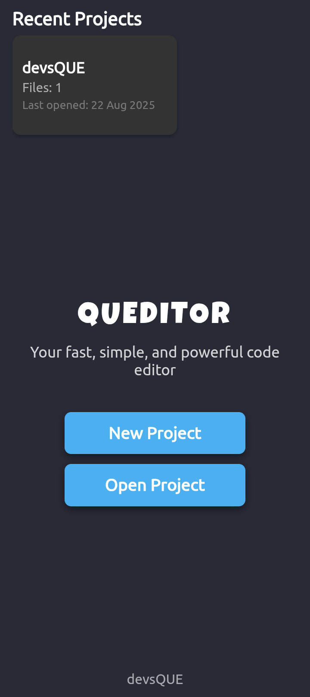
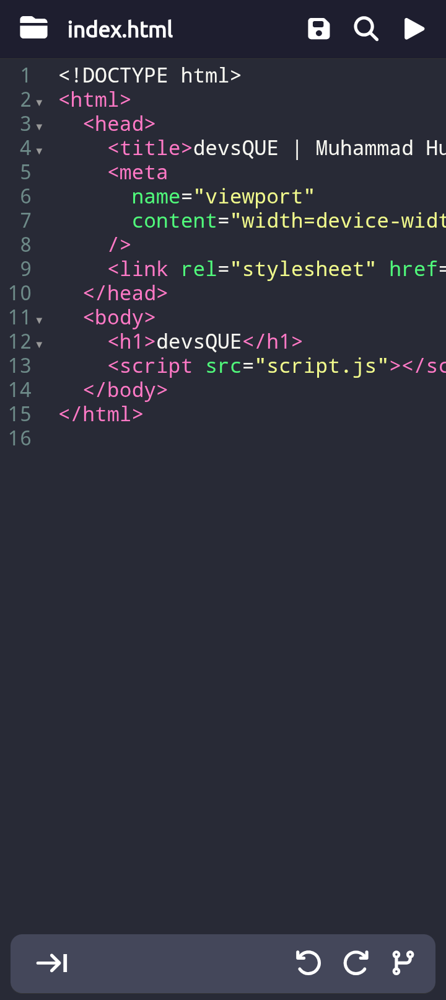
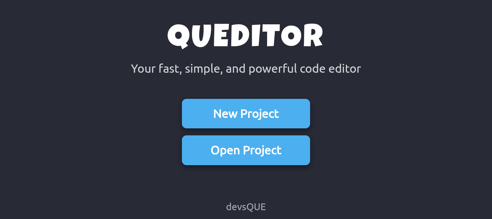
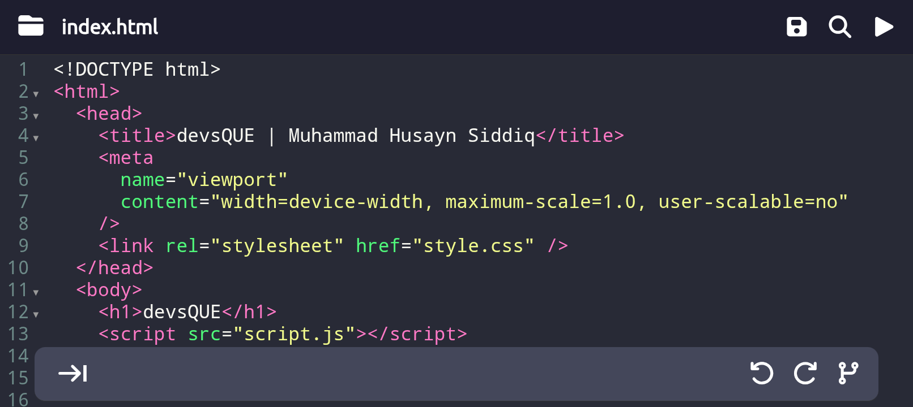
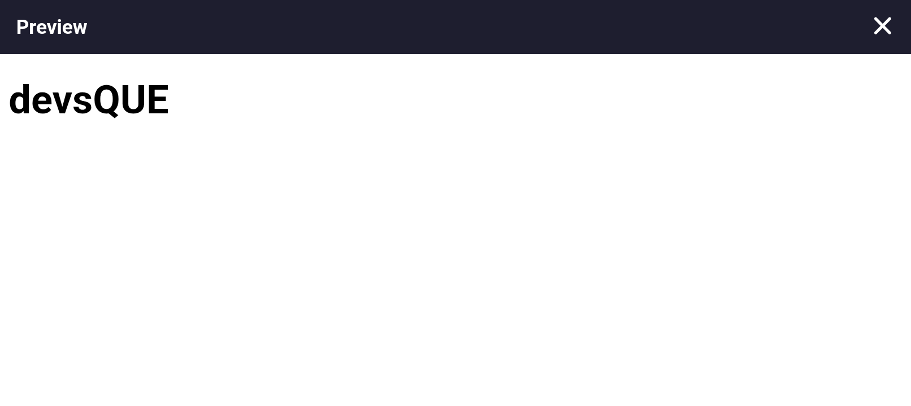

# Queditor - A Code Editor

Queditor is a browser-based code editor with file & folder management, code auto completion, code formating, preview, auto-save using IndexedDB, and offline support.

## ⚙️ Features
- Create and manage projects in the app
- Import zip as project
- Export project as zip
- Add, rename, delete file/folder
- Drag and drop for copy file/folder
- Drag and drop for move file/folder
- Import file
- Syntax highlighting
- Auto Completion
- Code formating
- Undo/Redo
- Search and replace
- Auto-save to IndexedDB
- Manual-save to IndexedDB
- Preview of project (only index.html)
- Offline support with local assets

## 📸 Screenshots

<!-- Portrait Screenshots -->

  
  
  

<!-- Landscape Screenshots -->

## 👤 Developer
**Mohammad Hussain**  
GitHub: [@devsQUE](https://github.com/devsQUE)

## 📜 License
This project is licensed under the MIT License - see the [LICENSE](LICENSE) file for details.
